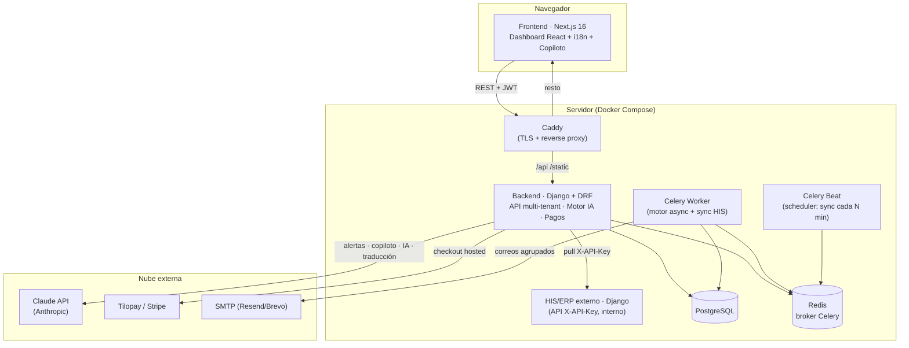
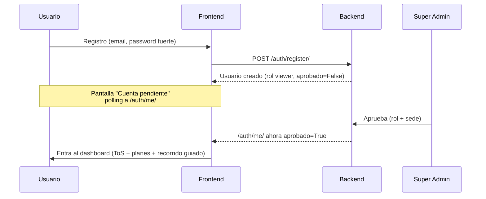
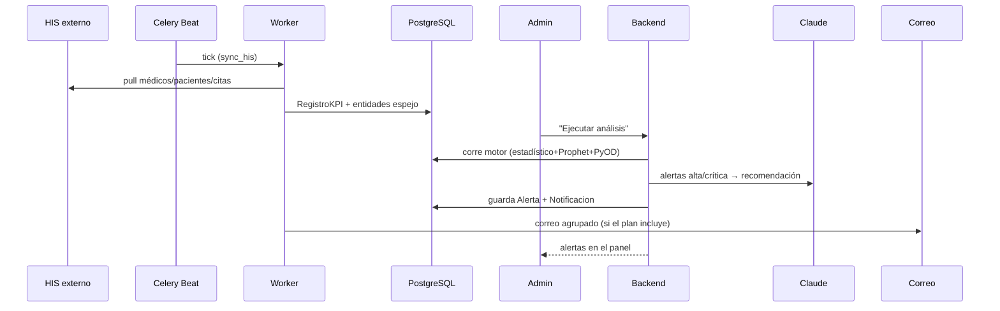
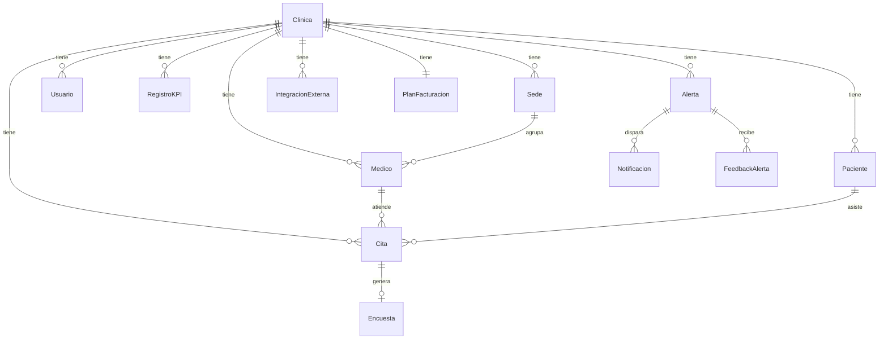
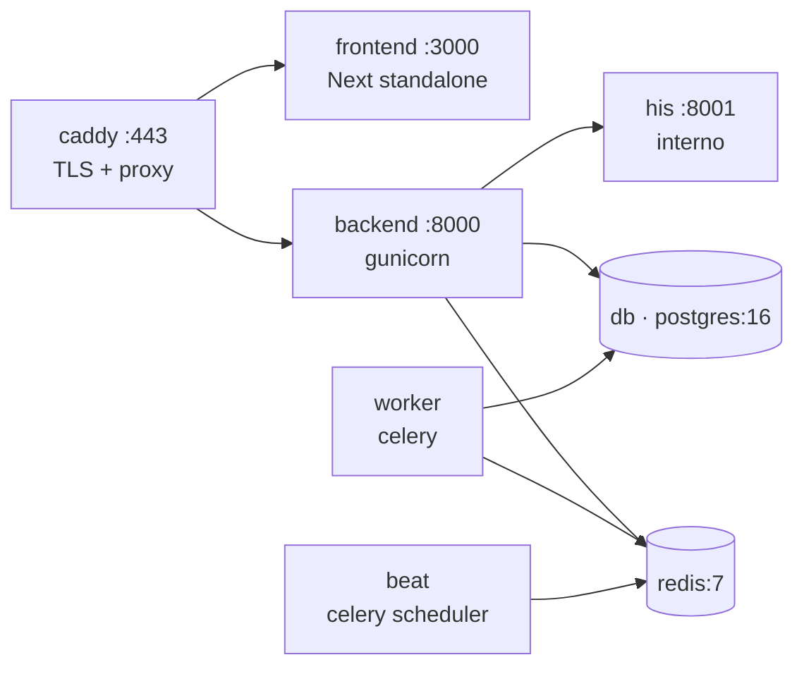

<div align="center">

# 🩺 Vigía — Documentación Técnica Completa

**Sistema de Alertas Inteligentes para Clínicas Médicas**

`Next.js 16` · `Django 6` · `Celery` · `PostgreSQL` · `Redis` · `Claude AI` · `Docker`

_Documento maestro del proyecto: explicación de negocio y técnica exhaustiva —
arquitectura, cada archivo, cada página, base de datos, IA, seguridad, correos,
diseño, integraciones, Docker y hospedaje._

</div>

---

## 📑 Índice

1. [Resumen ejecutivo](#1-resumen-ejecutivo)
2. [Arquitectura general](#2-arquitectura-general)
3. [Flujo completo del proyecto](#3-flujo-completo-del-proyecto)
4. [Stack tecnológico](#4-stack-tecnológico)
5. [Backend — anatomía completa](#5-backend--anatomía-completa)
   - 5.1 [Estructura de archivos](#51-estructura-de-archivos)
   - 5.2 [Modelo de datos (base de datos)](#52-modelo-de-datos-base-de-datos)
   - 5.3 [API REST — endpoints](#53-api-rest--endpoints)
   - 5.4 [Autenticación y JWT](#54-autenticación-y-jwt)
   - 5.5 [Permisos y multi-tenant](#55-permisos-y-multi-tenant)
   - 5.6 [Motor de detección de anomalías](#56-motor-de-detección-de-anomalías)
   - 5.7 [Inteligencia Artificial (Claude)](#57-inteligencia-artificial-claude)
   - 5.8 [Tareas asíncronas (Celery)](#58-tareas-asíncronas-celery)
   - 5.9 [Correos electrónicos](#59-correos-electrónicos)
   - 5.10 [Planes y facturación](#510-planes-y-facturación)
   - 5.11 [Configuración y seguridad (settings)](#511-configuración-y-seguridad-settings)
6. [Frontend — anatomía completa](#6-frontend--anatomía-completa)
   - 6.1 [Estructura de archivos](#61-estructura-de-archivos)
   - 6.2 [Página por página](#62-página-por-página)
   - 6.3 [Componentes](#63-componentes)
   - 6.4 [Estado global (stores)](#64-estado-global-stores)
   - 6.5 [Librerías y hooks](#65-librerías-y-hooks)
   - 6.6 [Internacionalización (ES ↔ EN)](#66-internacionalización-es--en)
   - 6.7 [Recorrido guiado](#67-recorrido-guiado)
   - 6.8 [Diseño e interfaz](#68-diseño-e-interfaz)
   - 6.9 [Manejo de errores](#69-manejo-de-errores)
7. [HIS/ERP externo](#7-hiserp-externo)
8. [Seguridad informática](#8-seguridad-informática)
9. [Docker y hospedaje](#9-docker-y-hospedaje)
10. [Cómo correrlo](#10-cómo-correrlo)
11. [Glosario](#11-glosario)

---

## 1. Resumen ejecutivo

**Vigía** vigila la salud operativa de una clínica médica y avisa cuando un indicador se comporta de forma anómala, antes de que se convierta en un problema. Una clínica produce muchos números cada día (ingresos, citas, cancelaciones, ausencias, retención, satisfacción); revisarlos a mano es lento y propenso a errores. Vigía:

1. **Ingiere los datos** desde el sistema hospitalario de la clínica (HIS/ERP) o desde un CSV.
2. **Detecta anomalías** con tres métodos combinados (estadístico + Prophet + PyOD).
3. **Explica y recomienda** con IA (Claude) para las alertas graves.
4. **Notifica** en el panel y, según el plan, por correo.

Es un **SaaS multi-tenant**: cada clínica es un inquilino aislado, con roles internos (admin, gerente, personal médico, usuario) y un **super admin** que administra la plataforma. Se monetiza con **planes** (Gratis / Básico / Profesional / Enterprise) que hacen *gating* de funciones. Incluye copiloto conversacional con IA, reportes, interfaz **bilingüe (ES/EN)** y **pagos por pasarela** (Tilopay / Stripe) en modo prueba.

| | |
|---|---|
| **Repos** | `CarrilloCR/vigia` (backend) · `CarrilloCR/vigia-frontend` (este) · `CarrilloCR/his-rep` (HIS demo) · `CarrilloCR/deploy-vigia` (infra) |
| **Producción** | Docker Compose + Caddy (TLS automático) sobre un droplet DigitalOcean, dominio `*.sslip.io` |
| **Idioma UI** | Español (por defecto) + Inglés (traducción global) |
| **Modelo de negocio** | SaaS por suscripción (pagos simulados, sin cobro real) |

---

## 2. Arquitectura general

Vigía son **cuatro piezas** que se comunican por HTTP, más infraestructura de soporte.



**Por qué así:**
- **Frontend y backend separados** → el frontend es una SPA estática servida por Node; el backend es una API pura. Escalan y se despliegan independientemente.
- **Celery + Redis** → el motor de detección y el envío de correos son pesados/lentos; se ejecutan fuera del ciclo de request para no bloquear al usuario.
- **HIS como servicio aparte** → simula el sistema real de un hospital; Vigía lo consume por API igual que lo haría con un cliente real. Nunca se expone a internet.
- **Caddy** → un único punto de entrada con HTTPS automático que enruta `/api` al backend y todo lo demás al frontend.

---

## 3. Flujo completo del proyecto

### 3.1 Alta y aprobación de usuarios



### 3.2 Datos → detección → alerta → notificación



---

## 4. Stack tecnológico

### Backend (`requirements.txt`)

| Tecnología | Versión | Para qué |
|---|---|---|
| **Django** | 6.0.3 | Framework web / ORM / migraciones |
| **djangorestframework** | 3.17 | API REST (ViewSets, serializers) |
| **djangorestframework-simplejwt** | 5.5 | Autenticación JWT (access/refresh) |
| **Celery** + **django-celery-beat** | 5.6 / 2.9 | Tareas asíncronas + scheduler en BD |
| **Redis** (cliente) | 7.3 | Broker y result-backend de Celery |
| **psycopg2-binary** | 2.9 | Driver PostgreSQL |
| **anthropic** | 0.86 | SDK de Claude (IA) |
| **prophet** | ≥1.1.5 | Series temporales (predicción de rango) |
| **pyod** | ≥1.1 | Detección de outliers (Isolation Forest) |
| **pandas / numpy** | ≥2.1 / ≥1.26 | Manipulación numérica de series |
| **argon2-cffi** | 25.1 | Hashing de contraseñas (Argon2) |
| **stripe** | 15.0 | Pasarela de pago (test) |
| **requests** | 2.33 | Llamadas HTTP a Tilopay y al HIS |
| **gunicorn** | ≥22 | Servidor WSGI de producción |
| **whitenoise** | ≥6.6 | Servir estáticos comprimidos |
| **django-cors-headers** | 4.9 | CORS controlado por entorno |

### Frontend (`package.json`)

| Tecnología | Para qué |
|---|---|
| **Next.js 16** (App Router, output standalone) | Framework React, SSR/estático, build de producción |
| **React 19** + **TypeScript** | UI declarativa tipada |
| **Tailwind CSS v4** | Utilidades de estilo + tokens por `data-theme` |
| **Zustand** (+ persist) | Estado global en `localStorage` |
| **Axios** | Cliente HTTP con interceptores JWT |
| **Framer Motion** | Animaciones y transiciones |
| **Recharts** | Gráficos de KPIs |

---

## 5. Backend — anatomía completa

Repositorio `CarrilloCR/vigia`. App principal `core/`, proyecto Django `vigia_backend/`.

### 5.1 Estructura de archivos

| Archivo | LOC | Qué hace | Importancia | Depende de |
|---|---:|---|---|---|
| `core/models.py` | 378 | Define los **17 modelos** de dominio (la base de datos). | 🔴 Crítica | Django ORM |
| `core/views.py` | 2647 | **Corazón de la API**: ViewSets + ~40 endpoints función (motor, IA, pagos, HIS). | 🔴 Crítica | DRF, motor, planes, anthropic, stripe, requests |
| `core/auth.py` | 310 | Registro, login, JWT, cambio de contraseña, cerrar sesiones, borrar perfil. | 🔴 Crítica | SimpleJWT, argon2 |
| `core/permissions.py` | 106 | `RoleBasedAccess`: matriz de permisos por rol + scoping multi-tenant. | 🔴 Crítica | DRF permissions |
| `core/planes.py` | 162 | **Fuente única de verdad** de planes (precios, límites, features). | 🟠 Alta | — |
| `core/motor.py` | 407 | Motor de detección: cálculo de KPIs + orquestación + dedup + mensajes/IA. | 🔴 Crítica | deteccion, models, anthropic |
| `core/deteccion.py` | 247 | Algoritmos: estadístico, Prophet, PyOD y **ensamble**. | 🟠 Alta | numpy, pandas, prophet, pyod |
| `core/tasks.py` | 518 | Tareas Celery: sync HIS, motor async, correos agrupados. | 🟠 Alta | celery, models, email |
| `core/serializers.py` | 146 | Serializers DRF (JSON ↔ modelos). | 🟡 Media | DRF |
| `core/generador.py` | 128 | Generador sintético de datos (dev/testing; reemplazado por HIS en prod). | 🟢 Baja | models |
| `core/admin.py` | 87 | Registro de modelos en el admin de Django. | 🟢 Baja | Django admin |
| `core/urls.py` | 86 | Enrutado: `router` (ViewSets) + paths de funciones. | 🟠 Alta | DRF router |
| `core/management/commands/sync_his.py` | — | Comando: *pull* del HIS → `RegistroKPI` (consolida en sede principal). | 🟠 Alta | requests, models |
| `core/management/commands/bootstrap_demo.py` | — | Comando idempotente: superadmin + clínica demo + HIS + primer sync. | 🟡 Media | models, sync_his |
| `vigia_backend/settings.py` | 216 | Configuración: seguridad, JWT, CORS, email, Celery, storages, BD. | 🔴 Crítica | env vars |
| `vigia_backend/celery.py` | 7 | Instancia de la app Celery. | 🟠 Alta | celery |
| `vigia_backend/urls.py` | 6 | URLconf raíz (incluye `core.urls` bajo `/api/`). | 🟠 Alta | — |

### 5.2 Modelo de datos (base de datos)

PostgreSQL en producción, SQLite en desarrollo. Todo cuelga de `Clinica` (raíz del multi-tenant). **17 modelos:**



| Modelo | Rol | Campos destacados |
|---|---|---|
| **Clinica** | Inquilino raíz. | `nombre`, `plan`, `terminos_aceptados`, `motor_automatico`, `motor_intervalo_horas`, `claude_activo`, `whatsapp_numero`, `notif_severidades`, branding (`logo` base64, `color_acento`). |
| **Sede** | Sucursal de una clínica. | `nombre`, `ciudad`. Toda clínica nace con 1 sede principal. |
| **Usuario** | Miembro de una clínica (no es el `User` de Django). | `email` (único), `password_hash`, `rol`, `aprobado`, `sede`, `avatar`. |
| **Medico** | Profesional. Puede vincularse a un `Usuario` (Mi Consultorio). | `nombre`, `especialidad`, `sede`. |
| **Paciente** | Paciente de la clínica. | `nombre`, `identificacion`, `telefono`, `primera_visita`. |
| **Cita** | Núcleo transaccional paciente-médico-sede. | `estado` (agendada/completada/cancelada/no_show/reagendada), `ingreso`, `es_primera_visita`, `fecha_hora`. |
| **Encuesta** | Satisfacción (NPS) 1:1 con una cita. | `puntuacion` (0-10). |
| **RegistroKPI** | Punto de una serie temporal de un KPI. | `tipo`, `valor`, `fecha_hora`, `periodo`, FKs a sede/médico. |
| **Alerta** | Anomalía detectada. | `tipo_kpi`, `valor_detectado`, `valor_esperado`, `desviacion`, `severidad`, `mensaje`, `recomendacion`, `metodo_deteccion`, `detalle_deteccion` (JSON), `estado`. |
| **Notificacion** | Aviso derivado de alertas (in-app / correo). | destino, estado leído. |
| **FeedbackAlerta** | Retro del usuario sobre una alerta (útil/no). | — |
| **ConfiguracionAlerta** | Umbrales y reglas por KPI. | — |
| **IntegracionExterna** | Conexión al HIS/ERP. | `api_key`, `api_url`, `estado`, `mapeo` (columnas mapeadas por IA), `ultima_sync`. |
| **SyncLog** | Bitácora de sincronizaciones con el HIS. | — |
| **PlanFacturacion** | Suscripción de la clínica. | `plan`, `monto`, `moneda`, `estado`, `fecha_renovacion`, `ultimos_cuatro`, `marca_tarjeta`, `stripe_customer_id`. |
| **EmailNotificacion** | Destinatarios de correo por clínica. | email, severidades. |
| **SolicitudPlan** | Pedido de Enterprise (→ super admin). | mensaje, estado. |
| **SolicitudRol** | Pedido de cambio de rol. | rol solicitado, estado. |

### 5.3 API REST — endpoints

**ViewSets** (CRUD con scoping automático, registrados en el `router` de DRF):
`clinicas`, `sedes`, `usuarios`, `medicos`, `pacientes`, `citas`, `encuestas`, `kpis`, `alertas`, `notificaciones`, `feedbacks`, `configuraciones`, `integraciones`, `synclogs`, `planes`, `emails-notificacion`, `solicitudes-rol`.

**Endpoints función (agrupados por dominio):**

<details>
<summary><b>🔐 Autenticación</b> (<code>core/auth.py</code>)</summary>

| Método | Ruta | Qué hace |
|---|---|---|
| POST | `/auth/register/` | Crea usuario (o se une a clínica); valida fuerza de contraseña. |
| POST | `/auth/login/` | Devuelve JWT (access/refresh) + `user` dict. |
| GET | `/auth/me/` | Refresca el `user` (incluye `aprobado`) — usado por el polling. |
| POST | `/auth/logout/` | Cierra sesión. |
| PUT | `/auth/cambiar-password/` | Cambia contraseña (pide la actual). |
| POST | `/auth/cerrar-sesiones/` | Invalida sesiones en otros dispositivos. |
| POST | `/auth/abandonar-clinica/` | El usuario deja la clínica. |
| POST | `/auth/borrar-perfil/` | Borra los datos de perfil. |
| POST | `/auth/refresh/` | Renueva el access token. |
</details>

<details>
<summary><b>📊 Motor, KPIs y HIS</b></summary>

| Método | Ruta | Qué hace |
|---|---|---|
| POST | `/motor/ejecutar/` | Corre el motor de detección (async vía Celery, sync si no hay worker). |
| GET | `/kpis/` · `/kpis/volumen_horario/` | Series de KPIs (diarias / por hora). |
| GET | `/kpis/exportar/` | CSV con datos + scores de detección. |
| GET | `/medicos/series/` | Series por médico. |
| GET | `/his/resumen/` | Resumen del HIS espejado. |
| POST | `/integraciones/his/probar/` · `/mapear/` · `/conectar/` | Probar conexión · mapear columnas (Claude) · conectar. |
| POST | `/integraciones/sync-his/` | Fuerza una sincronización. |
| GET | `/reportes/descargar/` | Reporte descargable. |
</details>

<details>
<summary><b>🤖 Inteligencia Artificial</b></summary>

| Método | Ruta | Qué hace | Gating |
|---|---|---|---|
| GET | `/ia/saturacion/` | Predicción de saturación de citas por sede. | plan |
| GET | `/ia/tendencias/` | Análisis de tendencias (mejoras/riesgos/acciones). | plan |
| GET | `/ia/noshow-riesgo/` | Riesgo de ausencia de próximas citas. | plan |
| GET | `/ia/resumen-ejecutivo/` | Resumen del día (+ envío por correo). | plan |
| POST | `/ia/copiloto/` | Chat sobre los datos de la clínica. | pro |
| POST | `/ia/traducir/` | Traducción ES→EN de la UI (fallback i18n). | — |
</details>

<details>
<summary><b>💳 Facturación y pagos</b></summary>

| Método | Ruta | Qué hace |
|---|---|---|
| GET | `/facturacion/planes/` | Planes disponibles + estado actual. |
| POST | `/facturacion/simular-suscripcion/` | Activa plan (simulado, sin cobro). |
| POST | `/facturacion/tilopay/crear/` · `/confirmar/` | Checkout Tilopay (token firmado, `code==1`). |
| POST | `/facturacion/stripe/crear/` · `/confirmar/` | Checkout Stripe test (`payment_status==paid`). |
| POST | `/facturacion/aceptar-terminos/` | Marca ToS aceptados. |
| POST | `/facturacion/solicitar-enterprise/` | Solicita Enterprise (→ super admin + correo). |
| GET/POST | `/facturacion/solicitudes-plan/…/resolver/` | Lista y resuelve solicitudes. |
</details>

### 5.4 Autenticación y JWT

`core/auth.py`:
- **Registro** (`register`) — valida fuerza de contraseña (`validate_password_strength`), crea el `Usuario` con rol `viewer` y `aprobado=False`, hashea con Argon2.
- **Login** (`login`) — verifica credenciales y emite **access + refresh** con SimpleJWT (`get_tokens_for_user`); devuelve `_user_dict` (id, nombre, rol, clínica, sede, aprobado).
- **`me`** — el frontend lo consulta en bucle mientras la cuenta esté pendiente, para detectar la aprobación sin re-login.
- **Seguridad de sesión** — `cerrar_sesiones` invalida tokens en otros dispositivos; `cambiar_password` exige la contraseña actual; `abandonar_clinica` y `borrar_datos_perfil` dan control al usuario sobre sus datos.

### 5.5 Permisos y multi-tenant

`core/permissions.py` → `RoleBasedAccess`. Dos capas:
1. **Scoping por inquilino** — cada queryset se filtra por la `Clinica` (y `Sede`) del usuario. `apply_sede_scope` y `apply_medico_scope` (en `views.py`) acotan a nivel de sede/médico.
2. **Matriz de permisos por rol**:

| Rol | Aprobación | Alcance |
|---|---|---|
| `superadmin` | implícita | Todas las clínicas y acciones. **Protegido**: ningún rol lo edita/elimina. |
| `admin` | requerida | CRUD completo dentro de su clínica. |
| `gerente` | requerida | CRUD en su sede; lectura de toda la clínica. |
| `medico` | requerida | Scope a su sede + su propio perfil (Mi Consultorio). |
| `user` | requerida | Lectura de KPIs, alertas, médicos, notificaciones. |
| `viewer` | pendiente | Sin acceso hasta ser aprobado. |

> El gating del frontend es UX; **la autoridad la enforza el backend** en cada request.

### 5.6 Motor de detección de anomalías

Dos archivos trabajan juntos:

**`core/deteccion.py`** — los algoritmos, por cada KPI:
- `detectar_estadistico(valor, histórico, umbral)` — desviación respecto a media/percentiles; base robusta (p75 para saturación).
- `detectar_prophet(valor, histórico_con_fechas)` — modelo de series temporales (tendencia + estacionalidad) que predice el rango esperado; marca fuera-de-banda.
- `detectar_pyod(valor, histórico, contamination)` — Isolation Forest para outliers.
- `detectar_anomalia_ensemble(...)` — combina los tres; el veredicto y el `detalle_deteccion` (JSON) quedan en la alerta.

**`core/motor.py`** — cálculo de KPIs y orquestación:
- Calculadoras: `calcular_tasa_cancelacion`, `calcular_tasa_noshow`, `calcular_ingresos_dia`, `calcular_ticket_promedio`, `calcular_ocupacion_medico`, `calcular_pacientes_nuevos`, `calcular_retencion_90` (ventana móvil de 90 días), `calcular_nps`, `calcular_citas_reagendadas`.
- `determinar_severidad(desviacion)` → `baja`/`media`/`alta`/`critica`.
- `generar_mensaje(...)` (texto base) y `generar_recomendacion_ia(...)` (Claude, solo alta/crítica).
- `correr_motor(clinica_id)` — orquesta todo por clínica y por médico; `_ya_existe_alerta_activa(...)` **deduplica** (una alerta activa por clínica+sede+tipo_kpi+médico).

El motor se dispara **manualmente** (botón "Ejecutar análisis") para controlar el uso de la API de Claude.

### 5.7 Inteligencia Artificial (Claude)

Modelo `claude-sonnet-5` vía el SDK `anthropic`. Usos:

| Dónde | Qué genera |
|---|---|
| Motor (`generar_recomendacion_ia`) | Recomendación textual para alertas alta/crítica. |
| `/ia/tendencias/` | Lectura del histórico → mejoras, riesgos y acciones. |
| `/ia/saturacion/` | Proyección de demanda vs capacidad por sede. |
| `/ia/noshow-riesgo/` | Puntaje de ausencia por cita futura. |
| `/ia/resumen-ejecutivo/` | Texto breve del estado del día (enviable por correo). |
| `/ia/copiloto/` | Chat en lenguaje natural sobre los datos reales. |
| `/ia/traducir/` | Traducción ES→EN de la UI que no está en el diccionario estático. |
| Wizard de integración (`mapear_columnas_his`) | Mapea columnas del sistema externo → campos de Vigía. |

Todo lo de IA está **gated por plan** (`gratis` no lo usa) y respeta `clinica.claude_activo`. La clave `ANTHROPIC_API_KEY` vive solo en `.env`.

### 5.8 Tareas asíncronas (Celery)

`core/tasks.py` + `vigia_backend/celery.py`:
- `auto_sync_his_task` — sincroniza el HIS periódicamente (lo dispara **Celery Beat**).
- `ejecutar_motor_task(clinica_id)` — corre el motor fuera del request.
- `enviar_notificaciones_agrupadas_task` / `enviar_email_agrupado_task` — agrupan alertas en una sola notificación/correo.
- `dispatch(task, ...)` — helper que encola en Celery si hay worker, o corre síncrono si no (robustez en dev).

**Broker + result-backend:** Redis. En producción corren **worker** (concurrencia 4) y **beat** (scheduler en BD con `django-celery-beat`) como contenedores separados.

### 5.9 Correos electrónicos

- Backend SMTP genérico (`settings.py`): si `EMAIL_HOST` está seteado, usa `smtp.EmailBackend`; probado con **Resend** (`smtp.resend.com`) y compatible con Brevo/otros.
- `send_email(to, subject, html)` en `tasks.py`; los envíos son **agrupados** (una alerta = una notificación; varias alertas → un correo) y **configurables** por severidad y destinatarios (`EmailNotificacion`, `notif_severidades`).
- El correo es una **feature de plan** (Gratis no envía). Sin dominio verificado, el proveedor solo entrega al dueño de la cuenta (limitación del sandbox del proveedor, no de Vigía).

### 5.10 Planes y facturación

`core/planes.py` es la **fuente única**:

| Plan | Precio | Usuarios | Sedes | IA | Integraciones | Correo | Contratación |
|---|---:|---:|---:|:--:|:--:|:--:|---|
| **Gratis** | $0 | 5 | 1 | ❌ | ❌ (solo CSV) | ❌ | default |
| **Básico** | $29 | 20 | 2 | ✅ | ✅ | ✅ | compra |
| **Profesional** | $79 | + | + | ✅ | ✅ | ✅ | compra |
| **Enterprise** | a convenir | a medida | a medida | ✅ | ✅ | ✅ | acuerdo (super admin) |

El *gating* se aplica en runtime (`_gate_ia`, límites de usuarios/sedes, features de `Clinica`). **Pagos** (todos en modo prueba, sin cobro real):
- **Tilopay** — `tilopay_crear` hace `loginSdk` + `processPayment` (API CR) y devuelve la URL del checkout hosted; el plan/clínica viajan en un **token firmado** (`django.core.signing`); al volver, `tilopay_confirmar` valida el token + `code==1` y activa el plan.
- **Stripe** — `stripe_crear` crea un `Checkout Session` `mode=payment` con `price_data` inline (sin Price IDs ni webhook); `stripe_confirmar` recupera la sesión y activa solo si `payment_status=='paid'`.
- **Fallback** — si no hay credenciales, el checkout cae a la **simulación local** (`simular_suscripcion`). El helper `_activar_plan` centraliza la activación.

### 5.11 Configuración y seguridad (settings)

`vigia_backend/settings.py`:
- **`SECRET_KEY`** — obligatoria por env en producción; solo hay fallback inseguro en `DEBUG`.
- **`DEBUG`** por env; en producción `ALLOWED_HOSTS`, `CORS_ALLOWED_ORIGINS` y `CSRF_TRUSTED_ORIGINS` son allowlists explícitas.
- **HTTPS forzado**: `SECURE_SSL_REDIRECT`, `SECURE_HSTS_SECONDS` (1 año, subdominios + preload), `CSRF_COOKIE_SECURE`, `SECURE_PROXY_SSL_HEADER` (detrás de Caddy).
- **Hashing**: `PASSWORD_HASHERS` con **Argon2** primero.
- **Estáticos**: WhiteNoise con manifest + compresión solo en producción.
- **BD**: PostgreSQL si hay `DB_HOST`, si no SQLite.
- **Celery**: broker/result en `REDIS_URL`, contenido JSON.

---

## 6. Frontend — anatomía completa

Repositorio `CarrilloCR/vigia-frontend`. Next.js App Router bajo `src/`.

### 6.1 Estructura de archivos

```
src/
├── app/
│   ├── layout.tsx              # Root: ThemeProvider + AutoTranslate + CursorEffect + #app-zoom
│   ├── page.tsx                # Login / registro + hero animado
│   └── dashboard/
│       ├── layout.tsx          # Guard de auth + gating por rol + TerminosGate + GuidedTour
│       └── {13 páginas}        # (detalle abajo)
├── components/                 # 11 top-level + ui/ (21) + reactbits/ (22)
├── store/                      # auth, theme, prefs, toast, kpiPip
├── lib/                        # axios, i18n, guiaContenido, permisos, permissions, tourSteps, useSortPaginate
├── hooks/                      # usePermissions
└── types/index.ts             # Interfaces de dominio
```

### 6.2 Página por página

| Página (`src/app/…`) | Qué es | Cómo funciona / qué usa |
|---|---|---|
| `page.tsx` | **Login / registro**. | Formularios auth (`/auth/login`, `/auth/register`), hero animado `HeroDemo3D`, botón "?" con video. |
| `dashboard/layout.tsx` | **Shell del dashboard**. | Guard: exige JWT; hace polling de `/auth/me/` si pendiente; monta `DashboardHeader`, `TerminosGate`, `GuidedTour`, `CopilotoOrb`. Gating por rol. |
| `dashboard/page.tsx` | **Dashboard principal**. | Tarjetas de KPIs (`CountUp`), alertas activas por severidad, botón **Ejecutar análisis** (`/motor/ejecutar/`), widget HIS, lista de médicos. |
| `dashboard/kpis/page.tsx` | **Análisis de KPIs**. | Selector de KPI, controles (sede/días-horas/rango), gráfico `Recharts` con overlays de anomalías (Prophet/PyOD), panel `IaInsights`. |
| `dashboard/medicos/page.tsx` | **Listado de médicos**. | Búsqueda/orden/filtro (`useSortPaginate`), tarjetas → detalle. |
| `dashboard/medico/[id]/page.tsx` | **Detalle de médico**. | Pestañas Estadísticas/Citas/Alertas; "Mi Consultorio" si es personal médico; descarga de reporte. |
| `dashboard/pacientes/page.tsx` | **Listado de pacientes**. | Buscador, orden, paginación; fila → ficha. |
| `dashboard/paciente/[id]/page.tsx` | **Ficha de paciente**. | Médico(s) asignado(s), datos, historial de citas + stats. |
| `dashboard/citas/page.tsx` | **Agenda de citas**. | Stats (completadas/agendadas/canceladas), filtros por estado/médico, edición de estado. |
| `dashboard/notificaciones/page.tsx` | **Notificaciones**. | Historial de avisos; marca como leídas. |
| `dashboard/generador/page.tsx` | **HIS en vivo**. | `HisMirror`: espejo read-only del HIS conectado (`/his/resumen/`). |
| `dashboard/reportes/page.tsx` | **Reportes**. | Exportación CSV (alertas · datos HIS+IA), rango y sede. |
| `dashboard/correos/page.tsx` | **Correos**. | Gestión de destinatarios y severidades (`emails-notificacion`). |
| `dashboard/equipo/page.tsx` | **Equipo**. | Aprobar/rechazar miembros, asignar rol y sede, solicitudes. |
| `dashboard/configuracion/page.tsx` | **Configuración** (la más grande). | Cuenta, seguridad, apariencia (tema/idioma/fuente/cursor), clínica, integraciones, **facturación** (checkout Tilopay/Stripe), documentación por capítulos. |

### 6.3 Componentes

**Top-level (`components/`):**

| Componente | Función |
|---|---|
| `DashboardHeader` | Barra de navegación superior, filtrada por rol (`NAV_PERMISOS`). |
| `AutoTranslate` | Traductor global del DOM ES→EN (ver 6.6). |
| `GuidedTour` | Recorrido guiado spotlight (ver 6.7). |
| `TerminosGate` | ToS + aviso de planes en la 1ª entrada. |
| `CopilotoOrb` | Chatbot IA flotante con orbe animado (`/ia/copiloto/`). |
| `HisMirror` | Espejo read-only del HIS. |
| `IaInsights` | Panel de funciones IA en la página de KPIs. |
| `KpiMiniChart` | Mini-gráfico de KPI (picture-in-picture). |
| `CursorEffect` | Cursor personalizado (fuera del zoom para no escalar coordenadas). |
| `ThemeProvider` | Aplica el tema (`data-theme`). |
| `ProtectedRoute` | Guard de ruta por permiso. |

**`components/ui/` (21 primitivas):** `Button`, `Card`, `Input`, `Badge`, `SeverityBadge`, `Stat`, `Sparkline`, `Skeleton`, `PageLoader`, `PageShell`, `SectionHeading`, `ListControls`, `ConfirmModal`, `ToastContainer`, `ThemeToggle`, `VigiaLogo`, `CreditCard3D`, `ClinicaSwitcher`, `SedeSelector`, `PasswordRequirements`, `CursorGlow`.

**`components/reactbits/` (22 animados):** `Aurora`, `AuroraMesh`, `ShaderBackground`, `GlowingCard`, `SpotlightCard`, `TiltedCard`, `HeroDemo3D` (hero del login), `BlurText`, `DecryptedText`, `GradientText`, `ShinyText`, `CountUp`, `FadeContent`, `ScrollReveal`, `Magnet`, `GlareHover`, `ClickSpark`, `Ribbons`, `StarBorder`, `BorderGlow`, `ToggleSwitch`, `AnimatedInput`.

### 6.4 Estado global (stores)

Zustand con `persist` en `localStorage`:

| Store | Persiste | Contiene |
|---|---|---|
| `auth.ts` | `vigia-auth` | `user`, tokens JWT, `activeClinicaId` (super admin). |
| `theme.ts` | `vigia-theme` | tema claro/oscuro. |
| `prefs.ts` | `vigia-prefs` | idioma (ES/EN), animaciones, `fontSize`, cursor, `compacto`, `autoRefresh`, sonido. |
| `toast.ts` | — | cola de notificaciones toast. |
| `kpiPip.ts` | — | estado del mini-gráfico flotante. |

### 6.5 Librerías y hooks

| Archivo | Función |
|---|---|
| `lib/axios.ts` | Instancia Axios con interceptores: adjunta `Bearer` token, y ante **401** refresca vía `/auth/refresh/` y reintenta. |
| `lib/i18n.ts` | Diccionario estático ES→EN (`EN`) + `useT()`. |
| `lib/guiaContenido.tsx` | Contenido **bilingüe** de la Documentación / guía (`GUIA`, `GUIA_EN`, `getGuia`). |
| `lib/tourSteps.ts` | Pasos del recorrido guiado (targets `data-tour`, gating por rol/plan). |
| `lib/permisos.ts` / `permissions.ts` | `NAV_PERMISOS`, roles, matriz `canAccess`/`canWrite`. |
| `lib/useSortPaginate.ts` | Hook de orden + paginación para listados. |
| `hooks/usePermissions.ts` | Hook + guard de ruta por permiso. |

### 6.6 Internacionalización (ES ↔ EN)

Dos capas complementarias:
1. **Diccionario estático** (`lib/i18n.ts`) — ~200 frases comunes; traducción instantánea sin red.
2. **Traductor global del DOM** (`components/AutoTranslate.tsx`) — cuando el idioma es inglés, recorre el DOM con un `TreeWalker` + `MutationObserver`; lo que no está en el diccionario lo manda a `/ia/traducir/` (Claude), **cachea** el resultado en `localStorage` y lo reaplica. Traduce también `placeholder`/`title`/`aria-label`. Los **datos dinámicos** (nombres, números) se filtran y no se traducen. La Documentación y el recorrido tienen versión inglesa **nativa** (sin IA). Al volver a español, restaura los textos originales.

### 6.7 Recorrido guiado

`components/GuidedTour.tsx` + `lib/tourSteps.ts`: tour tipo **spotlight** que oscurece la página e **ilumina el elemento real** (marcado con `data-tour`), muestra flecha + cuadro explicativo y **navega entre páginas**. Se salta los pasos que el rol/plan del usuario no permite. El estado del recorrido vive en `sessionStorage` para sobrevivir al remonte al cambiar de página. Aparece la 1ª vez tras aceptar términos y se relanza desde Config → Documentación (evento `vigia-open-guia`).

### 6.8 Diseño e interfaz

- **Tokens CSS** por `data-theme` en `<html>` (dark por defecto, light disponible), definidos en `globals.css`.
- **Tipografías**: Inter (texto) + Syne (display, clase `.font-display`).
- **Animaciones**: Framer Motion (transiciones, `whileHover`/`whileTap`, `AnimatePresence`), respetando el toggle de animaciones de `prefs`.
- **Accesibilidad**: tamaño de fuente escalable (aplicado sobre `#app-zoom`, no sobre `<html>`, para no romper el cursor personalizado).
- **Marca**: acento jade; branding por clínica (logo base64 + `color_acento`).

### 6.9 Manejo de errores

- **Frontend** — interceptores de Axios (401 → refresh + retry); errores se muestran con **toasts** (`store/toast.ts` + `ToastContainer`) en vez de romper la UI; estados de carga con `Skeleton`/`PageLoader`; estados vacíos explícitos.
- **Backend** — respuestas DRF con códigos correctos (`400` validación, `402/403` gating/permisos, `404`, `502` fallo de servicio externo como Claude/Tilopay/HIS). Los endpoints de IA/pagos capturan excepciones del proveedor y devuelven un mensaje accionable en vez de un 500 opaco.

---

## 7. HIS/ERP externo

Repositorio `CarrilloCR/his-rep` (`/home/carrillo/his-erp`). Simula el sistema de un hospital real; Vigía lo consume por API igual que consumiría un HIS de un cliente.

- **Modelos** (`his/models.py`): `Sede`, `Medico`, `Paciente`, `Cita` (con `estado` e `ingreso`), `Encuesta` (NPS). Es su propia base de datos, independiente de Vigía.
- **API** — autenticada con cabecera `X-API-Key` (`his/auth.py`); expone médicos, pacientes, citas y KPIs (`his/kpis.py`, `his/views.py`).
- **Seed** — `management/commands/seed_his.py` genera datos realistas.
- **Integración con Vigía** — el comando `sync_his` de Vigía hace *pull*, mapea columnas (con ayuda de Claude en el wizard) y consolida todo en la sede principal de la clínica, generando `RegistroKPI`. Beat lo repite cada pocos minutos.
- **Aislamiento** — el HIS **no se expone a internet** (Caddy no lo enruta); solo el backend de Vigía lo alcanza por la red interna de Docker (`http://his:8001`).

---

## 8. Seguridad informática

| Área | Medida |
|---|---|
| **Contraseñas** | Hash **Argon2** (primer hasher); validador de fuerza en el registro. |
| **Sesiones** | **JWT** access/refresh (SimpleJWT); refresh automático en el frontend; cerrar sesiones remotas. |
| **Multi-tenant** | Scoping forzado por clínica/sede en **cada queryset** del backend; el frontend nunca decide permisos. |
| **Super admin** | Protegido: ningún rol puede editarlo ni eliminarlo. |
| **Transporte** | HTTPS forzado (Caddy TLS automático), HSTS 1 año + preload, cookies `Secure`. |
| **CORS/CSRF** | Allowlists explícitas por env en producción (`CORS_ALLOWED_ORIGINS`, `CSRF_TRUSTED_ORIGINS`). |
| **Secretos** | Claves (Claude, SMTP, pagos, `SECRET_KEY`) solo en `.env` (gitignored, `.env*`); nunca en el repo. |
| **Pagos** | Modo **prueba**: sin credenciales reales de cobro; token firmado anti-forgería en Tilopay; verificación server-side del pago en Stripe. |
| **HIS** | No expuesto a internet; autenticación por `X-API-Key`. |
| **Superficie IA** | La UI publicada tiene CSP estricta; las claves de IA nunca llegan al cliente (todo pasa por el backend). |

---

## 9. Docker y hospedaje

Repositorio `CarrilloCR/deploy-vigia`. **8 servicios** en un `docker-compose.yml`:



| Servicio | Imagen / build | Rol |
|---|---|---|
| `db` | `postgres:16-alpine` | Base de datos (dos bases: `vigia_db` + `his_db`). |
| `redis` | `redis:7-alpine` | Broker de Celery. |
| `backend` | build `../vigia` | API (gunicorn). `env_file: .env`. |
| `worker` | build `../vigia` | Celery worker (motor async + sync). |
| `beat` | build `../vigia` | Celery beat (scheduler). |
| `his` | build `../his-erp` | HIS externo (interno, no enrutado por Caddy). |
| `frontend` | build `../vigia-frontend` | Next.js standalone. |
| `caddy` | `caddy:2-alpine` | Reverse proxy + **TLS automático**. |

**`Caddyfile`** — enruta `/api/*` y `/static/*` al backend y **todo lo demás** al frontend; el HIS queda oculto. **Volúmenes**: `pgdata`, `redisdata`, `caddydata`, `caddyconfig`.

**Hospedaje** — droplet **DigitalOcean** (1.9 GB RAM), dominio gratuito vía **sslip.io** (`<ip-con-guiones>.sslip.io`) → HTTPS sin comprar dominio. `deploy.sh` hace `build` + `up -d` + `bootstrap_demo`. Notas operativas aprendidas:
- Compilar Prophet/pandas exige **swap** (≥4 GB) en droplets pequeños, o el build congela por OOM.
- `BUILDX_NO_DEFAULT_ATTESTATIONS=1` evita cuelgues de buildx.
- Los contenedores usan `restart: unless-stopped` → sobreviven a reinicios.
- Variables de pago (`STRIPE_SECRET_KEY`, `TILOPAY_*`) y `FRONTEND_URL` (la URL hosteada, no localhost) van en el `.env` del deploy.

---

## 10. Cómo correrlo

**Backend** (`CarrilloCR/vigia`):
```bash
python -m venv env && source env/bin/activate
pip install -r requirements.txt
cp .env.example .env          # completar SECRET_KEY, ANTHROPIC_API_KEY, etc.
python manage.py migrate
python manage.py bootstrap_demo   # superadmin + clínica demo con datos
./start.sh                        # worker + beat + runserver (:8000)
```

**Frontend** (este repo):
```bash
npm install
echo "NEXT_PUBLIC_API_URL=http://localhost:8000" > .env.local
npm run dev                       # :3000
```

**Todo el stack** (Docker, `CarrilloCR/deploy-vigia`):
```bash
cp .env.example .env && nano .env   # completar todo (SITE_ADDRESS, claves, pagos)
./deploy.sh                          # build + up -d + bootstrap
```

---

## 11. Glosario

| Término | Significado |
|---|---|
| **KPI** | Indicador clave (ingresos, no-show, retención, NPS…). |
| **HIS/ERP** | Sistema de información hospitalaria de la clínica (fuente de datos real). |
| **Motor** | Proceso que calcula KPIs y detecta anomalías. |
| **Ensemble** | Combinación de los tres métodos de detección. |
| **No-show** | Cita a la que el paciente no asistió. |
| **Multi-tenant** | Una sola app que aísla los datos de muchas clínicas. |
| **Gating** | Bloqueo de funciones según plan o rol. |
| **sslip.io** | Servicio que da un dominio derivado de una IP, para TLS sin comprar dominio. |

---

<div align="center">

**Vigía** — construido con Next.js · Django · Celery · Claude · Docker.
_Detecta anomalías, las explica con IA, las prioriza y las notifica._

</div>
